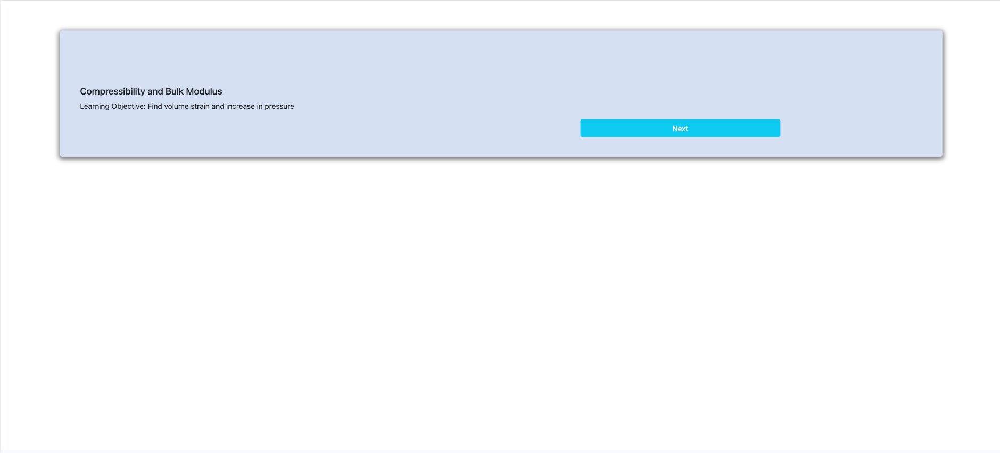
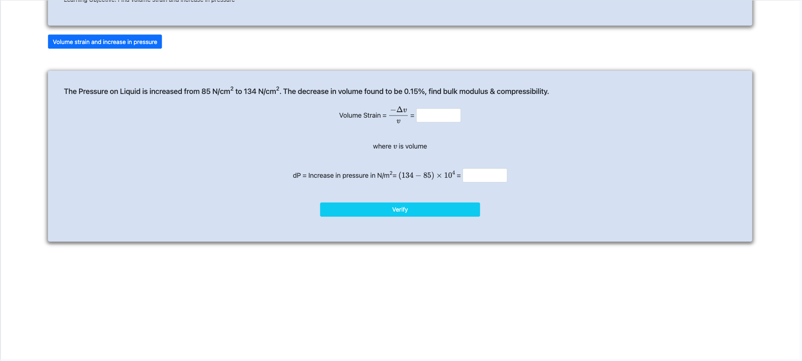
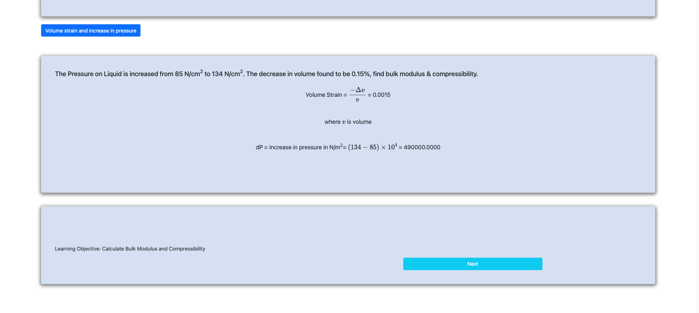
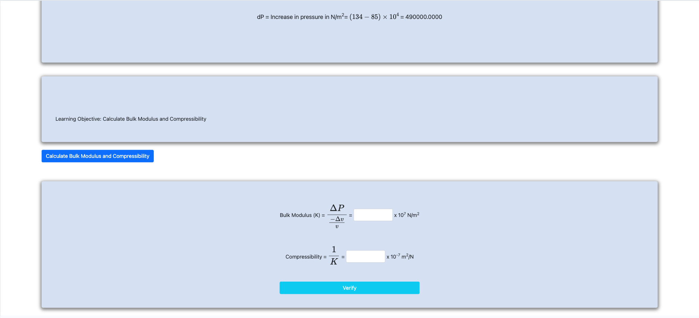

<h2>Follow the below steps to perform the experiment on the simulator</h2>
 

Step 1 : Click next to start.

Step 2 : Calculate volume strain and dp

Step 3 : Click next to start this activity

Step 4 : Calculate Bulk modulus and Compressibility

